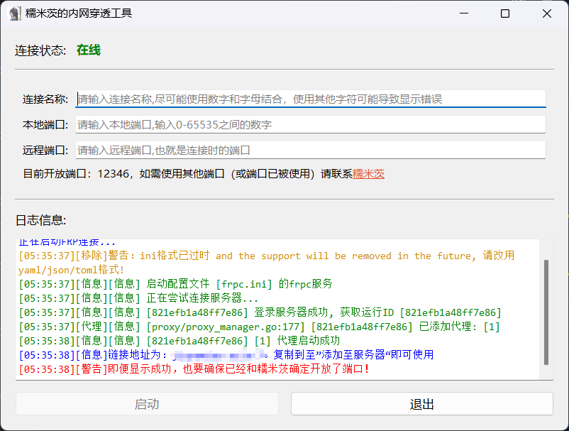

# FRP中文客户端（非官方）
下载后可能会报病毒，那个是frpc本身的问题。如果不信任我的话，可以去官方仓库下载程序包https://github.com/fatedier/frp
# 项目简介
一个可以快速创建专属简体中文FRP客户端的工具，支持自定义内容。工具由python编写。适合服务端管理人员。客户端人员也可以使用
# 功能介绍
  
  1.全中文界面：各项功能都用中文显示，让不懂那些英文单词的用户也可以快速入手  
  ##
  2.中文日志输出：大部分frpc的输出日志全部转化为中文，并附带少量问题解决建议，让用户少问点问题  
  ##
  3.多样化日志：提供多色日志输出，INFO（信息）、WARRING（警告）、ERROR（错误）分别用三色显示，其余内容用蓝色显示，用户可以快速判断哪里出错了，以及一些可能可以解决问题的方法  
  ##
  4.对于工具本身，有以下限制：  
###
（1）下载工具后，你需要先在配置文件中进行配置，包括但不限于  
  ①服务器地址  
  ②frps监听端口（默认7000）  
  ③个人联系方式（可选）  
  ④更多内容请于pyw文件中，搜索“＃”查看配置项  
此举目的：不会因为用户乱改配置文件而导致无法使用  
###
（2）frpc.ini必须于pyw中的设置配对（必须包含特定符号），默认为一个“[自定义符号]”。  
此举目的：防止用户在未经授权的情况下乱发导致端口被大量占用  
###
（3）该工具默认单词只允许运行一个代理项目（除非用户开了好几次应用）  
  ##
  5.代理启用时自动隐藏ini文件，旨在保护ini中token不被查看（虽然这个保护措施弱的要命）。代理结束后会改为“感谢您的使用~”，防止用户将ini备份，也是为了防止token泄露。
  ##
  6.实例  

# 使用方法
请看仓库中的“使用方法.md”
# 版权之类的
毕竟不是啥大项目，想用就用，记得打个名字上去就行。
# 未来计划  
还能有什么未来计划，基本上就这样子了，不过有个确实可以再细化一下  
1.计划将需要自定义的选项单独作为一个配置文件做出来，这样就不用麻烦你们手动打开pyw去慢慢找配置项了（完成了）  
# 其他
这只是个业余爱好者自制的工具，bug可能会有点多，只建议不做大规模分发使用的人！！
## 推荐分发人群
想玩MC开房间，但是没有合适的FRP工具的人
## 为啥做这个东西
自己买的服务器不足以支撑MC服务器运行，但是有着公网IP，不用白不用，服务器上部署frps，再本地用frpc转发出去。  
但是问题在于，只用一个端口有点太浪费了，所以把frp发给别人用，用来开房间。只是大部分人都是萌新，不懂咋用，所以做了这个工具  
往后我再稍微改改，把IP地址弄成可以在客户端里自定义的。  
# 总之就是为了玩！欢迎大家来找我玩！
# 贡献者
我自己！
